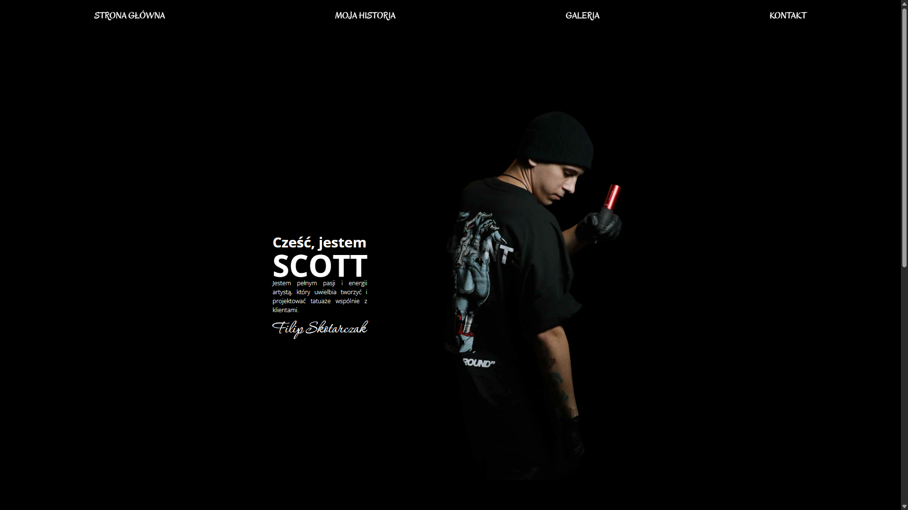
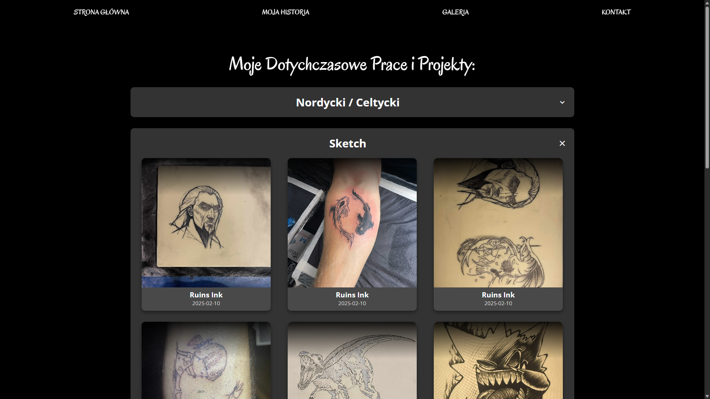
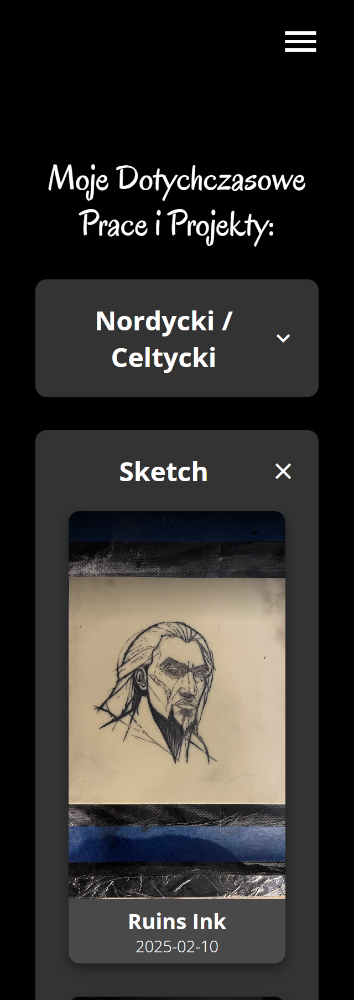

a# Tattoo Portfolio Scott

The **Tattoo Portfolio Scott** project is a web application that showcases a professional tattoo artist's portfolio. This project demonstrates the use of **React**, **TypeScript**, **HTML**, and **SCSS** to create a visually appealing, responsive, and interactive user experience for potential clients and tattoo enthusiasts.

---

## 📖 Table of Contents

- [🚀 Features](#-features)
- [📂 Project Structure](#-project-structure)
- [🛠️ Technologies Used](#️-technologies-used)
- [🌟 Key Functionalities](#-key-functionalities)
- [📸 Screenshots](#-screenshots)
- [⚙️ Installation and Usage](#️-installation-and-usage)
- [🤝 Contributing](#-contributing)
- [📜 License](#-license)

---

## 🚀 Features

- **Gallery Showcase**: Browse a categorized gallery of tattoo works by style and theme.
- **Photo Modal**: View tattoo photos in detail with a modal popup and additional information.
- **Responsive Design**: Optimized for both desktop and mobile devices.
- **Contact Page**: Easy-to-use contact details.
- **Modern UI**: Clean, professional, and user-friendly interface.

---

## 📂 Project Structure

The project is structured as follows:

```bash
Tattoo-Portfolio-Scott/
├── .gitignore              # Git ignore file
├── eslint.config.js        # ESLint configuration
├── index.html              # Main HTML file
├── LICENSE                 # License file
├── netlify.toml            # Netlify deployment config
├── package.json            # npm configuration file
├── README.md               # Project documentation
├── tsconfig.json           # TypeScript configuration
├── vite.config.ts          # Vite configuration
├── public/                 # Static files and images
│   ├── contact-background.jpg
│   ├── icon.png
│   ├── robots.txt
│   ├── sitemap.xml
│   └── scott-photos/       # Artist photos
│   └── tatoos/             # Tattoo images by category
└── src/                    # Main application source code
    ├── App.tsx             # Main application component
    ├── main.tsx            # Application entry point
    ├── tatooData.ts        # Tattoo data and categories
    ├── components/         # Reusable UI components
    │   ├── cards-gallery/
    │   ├── footer/
    │   ├── galleries-gallery/
    │   ├── main-home/
    │   ├── navbar/
    │   └── photo-card/
    ├── pages/              # Application pages
    │   ├── contact/
    │   ├── gallery/
    │   ├── home/
    │   └── my-history/
    └── styles/             # Global and variables SCSS
```

---

## 🛠️ Technologies Used

- **React**: A JavaScript library for building user interfaces.
- **TypeScript**: Strongly typed JavaScript for scalable apps.
- **Vite**: Fast build tool and development server.
- **SCSS**: For modular and maintainable styling.
- **Netlify**: For easy deployment and hosting.

---

## 🌟 Key Functionalities

1. **Gallery Browsing**:

   - Explore tattoos by style and category with smooth navigation.

2. **Photo Modal**:

   - Click on any tattoo to view it in a larger modal with details.

3. **Responsive Design**:

   - Seamless experience across desktops, tablets, and phones.

4. **Contact & Booking**:
   - Simple contact form for client inquiries and bookings.

---

## 📸 Screenshots

### Desktop View




### Mobile View
<table>
  <tr>
    <td></td>
    <td></td>
  </tr>
</table>

---

## ⚙️ Installation and Usage

1. Clone the repository:
   ```bash
   git clone https://github.com/Xelo04/Tattoo-Portfolio-Scott
   cd Tattoo-Portfolio-Scott
   ```
2. Install dependencies:
   ```bash
   npm install
   ```
3. Start the development server:
   ```bash
   npm run dev
   ```
4. Open the app in your browser at http://localhost:5173.

---

## 🤝 Contributing

Contributions are welcome! If you have suggestions or improvements, feel free to fork the repository and submit a pull request.

---

## 📜 License

This project is under the MIT License - see the [LICENSE](./LICENSE) file for details.
